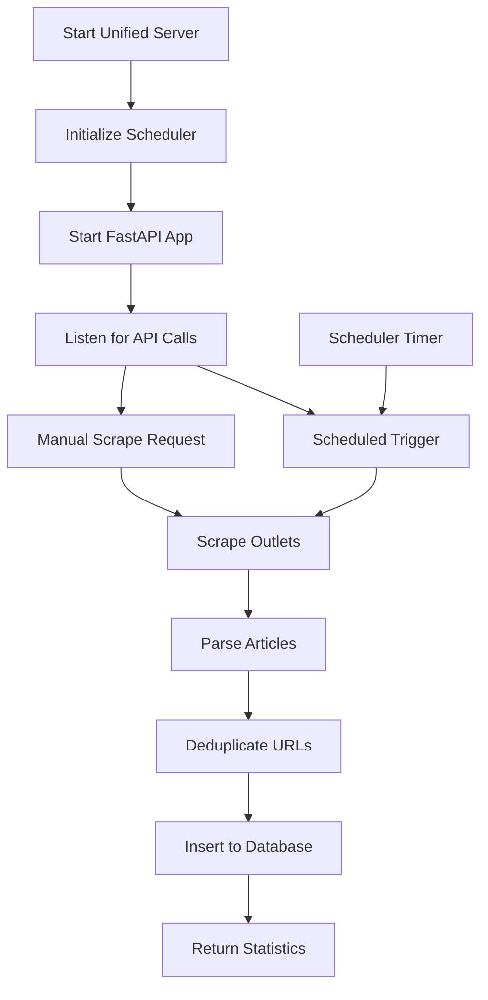

# Unified News Scraper Server - Complete Documentation

## 🎯 Overview

This unified server combines **news scraping**, **database population**, and **automated scheduling** into a single FastAPI application. No more running multiple scripts - everything is integrated!

### ✨ Key Features
- **Single Command Deployment**: One server handles everything
- **Scrape + Populate**: Articles are automatically saved to database
- **Automated Scheduling**: Set intervals for periodic scraping
- **Deduplication**: Built-in URL-based duplicate prevention
- **Real-time Monitoring**: API endpoints for status and statistics
- **Database Integration**: PostgreSQL with ON CONFLICT handling

## 🚀 Quick Start

### 1. Install Dependencies
```bash
cd online-news-scrapers
pip install -r requirements.txt
```

### 2. Set Environment Variables
```bash
# Database configuration
export DB_HOST=localhost
export DB_DATABASE=shottify_db_new
export DB_USER=postgres
export DB_PASSWORD=shottify123
export DB_PORT=5432
```

### 3. Create Database Tables
```bash
python create-database/content_items_table.py
```

### 4. Start Unified Server
```bash
# Method 1: Direct Python
python unified_server.py

# Method 2: Uvicorn (recommended for development)
uvicorn unified_server:app --reload --port 8000

# Method 3: Production
uvicorn unified_server:app --host 0.0.0.0 --port 8000 --workers 1
```

### 5. Access Interactive Docs
Visit: **http://localhost:8000/** for full API documentation

## 📋 Project Architecture

### New File Structure
```
online-news-scrapers/
├── unified_server.py           # 🆕 Main unified server
├── database_service.py         # 🆕 Database operations
├── server.py                   # Legacy scraper-only server
├── news_scrapers/              # Scraper modules (unchanged)
├── populate-table-final/       # Legacy population scripts
└── requirements.txt            # 🆕 Updated with new deps
```

### Execution Flow


## 🔄 How It Works

### Single Call Process
1. **API Request** → `/scrape-and-populate`
2. **Scraping** → Fetch articles from news websites
3. **Deduplication** → Remove duplicate URLs
4. **Database Insert** → Store with `ON CONFLICT (url) DO NOTHING`
5. **Statistics** → Return counts of inserted/duplicated articles

### Scheduler Process
1. **Timer Trigger** → Every N minutes (configurable)
2. **Batch Processing** → Scrape all configured outlets
3. **Automatic Population** → Save to database automatically
4. **Logging** → Log results and statistics

## 📝 API Endpoints

### Core Endpoints

| Method | Endpoint | Description |
|--------|----------|-------------|
| `GET` | `/` | Interactive API documentation |
| `GET` | `/health` | Server health check |
| `POST` | `/scrape-and-populate` | **Main endpoint** - scrape and save to DB |
| `POST` | `/scrape` | Legacy endpoint (scrape only, no DB) |

### Scheduler Management

| Method | Endpoint | Description |
|--------|----------|-------------|
| `GET` | `/scheduler/status` | Get scheduler status and config |
| `POST` | `/scheduler/configure` | Update scheduler settings |
| `POST` | `/scheduler/trigger` | Manually trigger scheduled job |
| `POST` | `/scheduler/start` | Start scheduler |
| `POST` | `/scheduler/stop` | Stop scheduler |

### Database & Monitoring

| Method | Endpoint | Description |
|--------|----------|-------------|
| `GET` | `/database/stats` | Article counts by platform |
| `GET` | `/outlets` | List all available outlets |

## 🎮 Usage Examples

### 1. Scrape and Populate Multiple Outlets
```bash
curl -X POST "http://localhost:8000/scrape-and-populate" \
     -H "Content-Type: application/json" \
     -d '{
       "outlets": ["hindustan_times", "news18", "economic_times"],
       "keyword": "bangladesh",
       "limit": 50,
       "page_size": 25
     }'
```

**Response:**
```json
{
  "summary": {
    "outlets_processed": 3,
    "total_scraped": 147,
    "total_inserted": 142,
    "total_duplicates": 5,
    "total_errors": 0
  },
  "results": [
    {
      "outlet": "hindustan_times",
      "scraped": 50,
      "unique": 50,
      "inserted": 48,
      "duplicates_skipped": 2,
      "errors": 0
    }
  ]
}
```

### 2. Configure Automated Scheduling
```bash
curl -X POST "http://localhost:8000/scheduler/configure" \
     -H "Content-Type: application/json" \
     -d '{
       "outlets": ["news18", "economic_times", "india_today"],
       "keyword": "politics",
       "limit": 30,
       "page_size": 20,
       "interval_minutes": 45
     }'
```

### 3. Check Database Statistics
```bash
curl "http://localhost:8000/database/stats"
```

**Response:**
```json
{
  "total_articles": 1247,
  "articles_by_platform": {
    "hindustan_times": 423,
    "news18": 367,
    "economic_times": 294,
    "india_today": 163
  },
  "platforms_count": 4
}
```

### 4. Manually Trigger Scheduled Job
```bash
curl -X POST "http://localhost:8000/scheduler/trigger"
```

## ⚙️ Configuration

### Default Scheduler Settings
```python
SCHEDULER_CONFIG = {
    'outlets': ['hindustan_times', 'news18', 'economic_times', 'india_today', 'business_standard'],
    'keyword': 'bangladesh',
    'limit': 50,
    'page_size': 25,
    'interval_minutes': 30  # Every 30 minutes
}
```

### Available Outlets (22 total)
```
Indian: hindustan_times, business_standard, news18, firstpost, 
        republic_world, india_dotcom, statesman, daily_pioneer,
        south_asia_monitor, economic_times, india_today, ndtv,
        the_tribune, indian_express, millennium_post, times_of_india,
        deccan_herald, abp_live, the_quint

International: the_guardian, washington_post
```

### Environment Variables
```bash
# Required Database Settings
DB_HOST=localhost
DB_DATABASE=shottify_db_new 
DB_USER=postgres
DB_PASSWORD=your_password
DB_PORT=5432

# Optional Settings
LOG_LEVEL=INFO
```

## 🔒 Database Deduplication

### Built-in Features
- **URL-based deduplication**: `ON CONFLICT (url) DO NOTHING`
- **Automatic statistics**: Track inserted vs skipped articles
- **Error handling**: Continue processing even if some articles fail

### Database Schema
```sql
CREATE TABLE content_items (
    id SERIAL PRIMARY KEY,
    source_id UUID,
    url TEXT UNIQUE,  -- Deduplication key
    title TEXT,
    content_text TEXT,
    author_name TEXT,
    published_at_text TEXT,
    platform TEXT,
    ingested_at TIMESTAMP DEFAULT NOW()
    -- ... other fields
);
```

## 📊 Monitoring & Logs

### Console Output
```
2025-07-20 10:30:00 - INFO - 🚀 Unified News Scraper Server started
2025-07-20 10:30:00 - INFO - 🕐 Scheduler configured for 30-minute intervals
2025-07-20 10:30:00 - INFO - 📰 Monitoring 5 outlets: ['hindustan_times', 'news18', ...]
2025-07-20 11:00:00 - INFO - 🔍 Scraping hindustan_times for 'bangladesh'...
2025-07-20 11:00:03 - INFO - ✅ hindustan_times: 48 inserted, 2 duplicates skipped, 0 errors
```

### Health Monitoring
```bash
# Check if server is healthy
curl http://localhost:8000/health
```

## 🔧 Troubleshooting

### Common Issues

| Issue | Solution |
|-------|----------|
| `ModuleNotFoundError: apscheduler` | `pip install -r requirements.txt` |
| Database connection error | Check environment variables |
| Scheduler not running | Check `/scheduler/status` endpoint |
| Articles not inserting | Verify database schema exists |

### Debug Mode
```bash
# Enable debug logging
export LOG_LEVEL=DEBUG
python unified_server.py
```

## 🆚 Comparison: Old vs New Process

### Old Process (2 steps)
```bash
# Step 1: Start server
uvicorn server:app --reload --port 8000

# Step 2: Run population script
python populate-table-final/content-populate.py
# (Manual input required)
```

### New Process (1 step)
```bash
# Single command starts everything
python unified_server.py

# Automatic scraping every 30 minutes
# Manual triggers via API
# Database population included
```

## 🎯 Key Benefits

✅ **Single Command**: Start everything with one command  
✅ **Automated**: Schedule scraping without manual intervention  
✅ **Integrated**: Scraping + database population in one call  
✅ **Deduplication**: Built-in duplicate prevention  
✅ **Monitoring**: Real-time statistics and status  
✅ **Scalable**: Configure outlets, intervals, and limits  
✅ **API-First**: Full REST API with interactive docs  

Your unified news scraper server is now ready for production use with automated scheduling and seamless database integration!